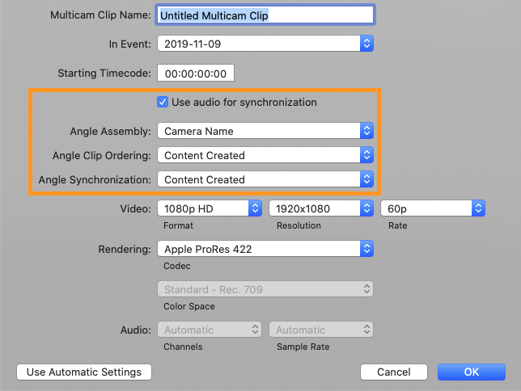
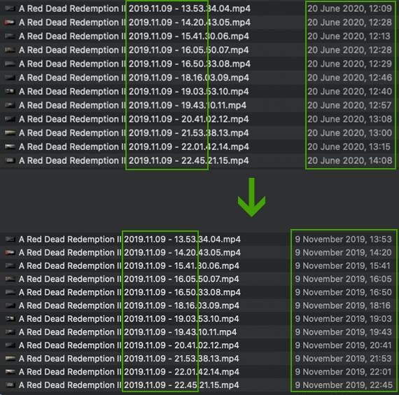

# fftb

Cross-platform CLI video editing toolbox

It can:
* fix file creation time
* convert it to HEVC or H.264 using ffmpeg & hardware acceleration
* split it to parts by filesize (alpha version)

## Installation

## Usage

### etime

*from Extract Time*

Final Cut Pro (and many other video editing tools) has a great feature for syncing videos from multiple cameras to multicam clip (TODO Watch more). In short videos, real footage & a couple of cameras it can be easily done by audio synchronization. But when discord ping comes in, the audio synchronization can take forever & the result may be completely wrong. Things getting better & faster when you use file creation timestamp to order & synchronize clips along with audio synchronization.



So it extracts creation time from filename and writes it to file's metadata. As you can see below, Nvidia's ShadowPlay saves files with a creation date in filename & metadata, but after some file movements across computers or disks this metadata can be lost and creation time from metadata does not match filename timestamp.



Currently, these filename patterns are supported:

* `NMS 22-05-2020 21-52-13.mp4` [(Mirillis Action!)](https://mirillis.com/en/products/action.html)
* `20180505_170735.mp4` [(AverMedia)](https://www.avermedia.com/en/product-detail/GC513)
* `Far Cry New Dawn 2020.02.12 - 23.03.10.00.DVR.mp4` (Nvidia ShadowPlay Instant replay)
* `Far Cry New Dawn 2020.02.12 - 23.03.10.00.mp4` (Nvidia ShadowPlay)
* `2016_05_20_15_31_51-ses.mp4` (plays tv)

Example usage:

```
$ fftb etime -R .
```

### convert

**[Read more about converting](docs/converting_guide.md)**

Convert video file to H264 or HEVC with hardware acceleration using [ffmpeg](https://ffmpeg.org), but without diving into ffmpeg's complexity. Optimized for converting game records.

* Supports hardware acceleration modes:
  * NVENC (for Nvidia cards, mainly for Windows)
  * VideoToolbox (for macOS)
* Parallelism! You can process 2 or more files in parallel & utilize more resources
* Has quality mode to obtain more accurate, variable bitrate
* Support YAML task configuration
* Can scale video to half or quarter of original resolution

Example usage:

```
$ fftb convert --video-codec hevc \
               --hwa videotoolbox \
               --video-bitrate 15M \
               --parallelism 2 \
               -R . ../out/
```

Options description:

* **`--video-codec`** Possible values: h264, hevc
* **`--hardware-acceleration`** Possible values: videotoolbox (for macs), nvenc (for Nvidia GPUs). By default uses x264/x265 CPU encoders
* **`--video-bitrate`** Ignores if `--video-quality` is passed. Examples: `25M`, `1600K`
* **`--video-quality`** `-crf` option for CPU encoding and `-qp` option for NVENC (VideoToolbox does not support quality mode, only bitrate). Integer from 1 to 51 (**30 is recommended** for game records)
* **`--scale`** Possible values: 1/2 (half resolution), 1/4 (quarter resolution)
* **`--parallelism`** Number of parallel ffmpeg workers. With higher parallelism value you can utilize more CPU/GPU resources, but in some situations ffmpeg can't run in parallel or will not give a profit
* **`--recursively`** Convert all video files in directory recursively
* **`--preset`** Encoding preset (prefer `slow` for best quality & `fast` for faster converting)
* **`--dry-run`** Do not execute conversion and print yaml task config (TODO)
* **`--config`** Config file path (TODO)

### split

**WARNING!** This tool is not tested well and can produce broken files (without video or audio)! Keep your original files.

Splits video file into parts by maximum size. Result files will be ≈ or < than `--chunk-size` value

Example usage:

```
$ fftb split --chunk-size 1G ./big_file.mp4 ./big_file_chunks/
```

## License
[MIT](https://choosealicense.com/licenses/mit/)
