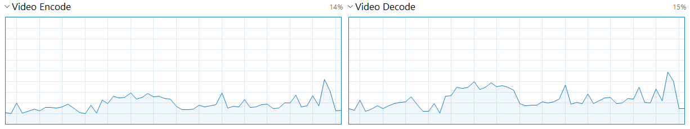
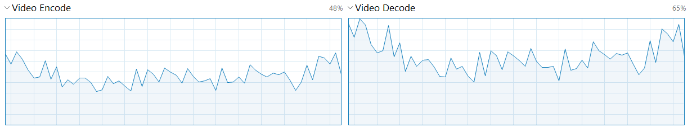

# Converting guide

## Codecs
`--video-codec <value>`

fftb supports two codecs: [H.264](https://en.wikipedia.org/wiki/Advanced_Video_Coding) and [HEVC](https://en.wikipedia.org/wiki/High_Efficiency_Video_Coding) (H.265).

### H.264 (`h264`)

H.264 you can meet everywhere — youtube, twitch, your phone camera. This codec is very popular and most of devices supports it. But long videos in high quality can take a lot of space. And here comes HEVC...

### HEVC (`hevc`)

In most cases HEVC is two times more effective than H.264 in storage. That is video files encoded with HEVC take half space than H.264.

The cost is more complex encoding & decoding for youк GPU/CPU and it can be bad choise for video editing on slow hardware.

So it can be useful when you capture your gameplay (with Nvidia ShadowPlay, for example) with H.264 codec and then convert it to HEVC to reduce space usage.

## Hardware acceleration
`--hardware-acceleration <value>`

Encoding with CPU produce converted video files with best quality, small result file size and preserved original colors. But it's extremely slow. It's a good result when encoding speed is about **30 FPS @ 1080p**. But in most cases it will be slower.

If you are on MacBook Pro or you have Nvidia GPU you may have special chip for getting such things faster. In some cases — **a lot** faster.

The cost is a little bigger files comparing to CPU encoding & a little worse quality.

### Nvidia's NVENC (`nvenc`)

If you have, for example, Nvidia GeForce 1080ti GPU with [NVENC](https://en.wikipedia.org/wiki/Nvidia_NVENC), you can reach **≈300 FPS @ 1080p** in total (with 2 parallel workers) while converting H.264 video files to HEVC (comparing to 30 FPS @ 1080p on CPU).

Known issue: NVENC can modify original colors even on same color settings.

NVENC hardware acceleration mode uses only GPU resources for decoding & encoding unlike other converters, so your CPU will be almost completely free while converting.

### Apple's VideoToolbox (`videotoolbox`)

If you are a Mac user, encoding with [Apple's VideoToolbox](https://handbrake.fr/docs/en/latest/technical/video-videotoolbox.html) can double your encoding FPS (depends on hardware).

I personally not recommend to use this kind of hardware acceleration because it's mostly build for fast encoding — not good. It have much fewer settings comparing to NVENC and requires a lot higher bitrate for good quality.

## Quality parameters

### Bit rate
`--video-bitrate <value>`

*Accordingly to [wiki](https://en.wikipedia.org/wiki/Bit_rate), bit rate is the number of bits that are conveyed or processed per unit of time (i.e. second).*

From my personal experience, good choise for game records @ 1080p is ≈30 mbit/s for H.264 and ≈15 mbit/s for HEVC. Encode with approximate bitrate is easiest & fastest (and the one for VideoToolbox) option for encoder. But not the best choise. Encoder will keep 30 mbit/s bitrate for scenes almost without motion (black screen) while, technically, 2 mbit/s will be absolutely enough. On the other hand — you will have scenes with a lot of motion, in those scenes better to have higher bitrate to capture all details without reducing the visual quality of picture. 

According to my experience, different games requires different approximate bitrate. Few examples: 
* For Battlefield 1 @ 1440p, encoded with HEVC best choise will be 20 mbit/s.
* For Red Dead Redemption II @ 1440p, 10 mbit/s in HEVC will be absolutely enough.

Different games, different monitor resolutions (not all of us playing on 1080p monitor) requires different presets. If you won't choose best bitrate setting for each case, your records will take up more space than really neccessary in case of too high bitrate. With too low bitrate you can loose quality from original record. But we just need to reduce space usage without loosing visual quality!

And here comes quality parameter...

### Quality
`--video-quality <value>`

fftb has quality option that will relieve headache from section above. Parameter received integer value from `1` to `51` where `1` is the best quality which takes a lot of space and is absolutely redundant, and `51` is the worst quality. I'm recommending you to choose `30` value for converting game records on any resolution, for any game.

Keep in mind that only one quality parameter can be passes — bitrate or quality (quality has higher priority)

## Presets
`--preset <value>`

Preset tells encoder to put attention to quality or encoding speed. Common preset names are `slow` (better quality), `medium` and `fast` (higher FPS). Different encoders has own preset list. To see them all, run `fftb convert -h`.

## Parallelism
`--parallelism <value>`

You can process more than one task at the same time if single worker does not utilize your resources good. This feature is developed mainly for hardware accelerated encoding, mostly for NVENC. In figure below you can find NVENC & NVDEC utilization while converting one task.

As you can see, only ≈20% of GPU resources is utilized and ≈80% is idle. There are many reasons why NVENC does not utilize all chip resources to convert one task faster like CPU does, but we can't speed up single task processing. Instead, we can run multiple tasks in parallel and that what will happen:

Most of the time second task will not affect first task's FPS and you should definitely use it. But keep in mind that some times there are hardware limitations of number of parallel tasks. My 1080ti can process **only 2** parallel tasks, for example.

## Configuration
`--dry-run` & `--config <file path>`
